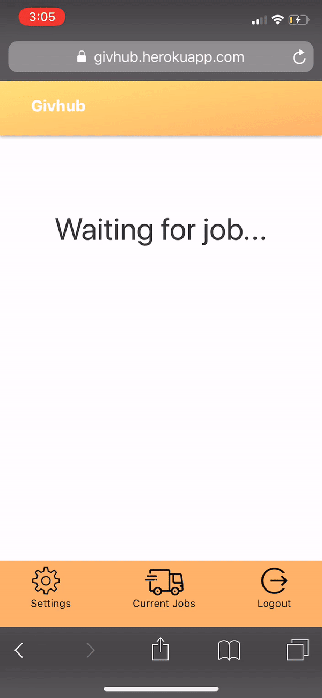

# Givhub: A Place To Give

## Requirements

​

* Operating System: MacOS, iOS, Windows, Android
* [Node.js]: To install necessary npm dependencies
* [Homebrew]: To install MongoDB
  ​

## Setup

​

* npm install
* brew tap mongodb/brew
* brew install mongodb-community
* brew services start mongodb-community
  ​

### Development

* npm run build-client - to initially compile webpack
* npm run build-client-watch - to compile webpack and configure webpack to watch mode
* npm run start-dev - to start server and have webpack recompile with changes
  ​

### Production

​

* npm start - to start server
* npm run deploy - to deploy the latest build in production
